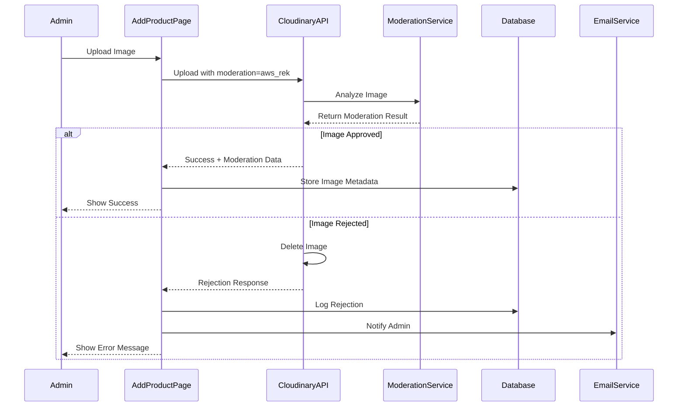

# Design Document

## Overview

This design outlines the synchronization of features between the product edit modal (`product-list.php`) and the add product page (`add-product.php`), plus the integration of Cloudinary's content moderation system. The goal is to create a consistent administrative experience while adding safety measures for image uploads.

## Architecture

### Component Structure

```
Add Product Page (add-product.php)
├── Form Container
│   ├── Basic Information Section
│   │   ├── SKU Field (readonly)
│   │   ├── Product Name Field
│   │   └── Category Dropdown (NEW)
│   ├── Pricing Section
│   │   ├── Price Field
│   │   └── Stock Field
│   ├── Description Section (ENHANCED)
│   ├── Image Management Section (ENHANCED)
│   │   ├── Primary Image Upload
│   │   └── Additional Images Upload (max 3)
│   ├── Shipping Configuration
│   ├── Availability Settings
│   └── Visibility Options
└── Cloudinary Moderation Service (NEW)
    ├── Upload Handler
    ├── Moderation Analyzer
    └── Result Processor
```

### Data Flow



## Components and Interfaces

### 1. Category Selection Component

**Location**: Between Product Name and Price/Stock fields

**HTML Structure**:
```html
<div class="form-group">
    <label for="productCategory">Category:</label>
    <select name="category_id" id="productCategory">
        <option value="">No Category</option>
        <?php
        // Fetch active categories
        $cat_sql = "SELECT id, name FROM categories WHERE is_active = 1 ORDER BY display_order ASC, name ASC";
        $cat_result = mysqli_query($conn, $cat_sql);
        while ($cat_row = mysqli_fetch_assoc($cat_result)) {
            echo "<option value='" . $cat_row['id'] . "'>" . htmlspecialchars($cat_row['name']) . "</option>";
        }
        ?>
    </select>
</div>
```

**Database Integration**:
- Query: `SELECT id, name FROM categories WHERE is_active = 1 ORDER BY display_order ASC, name ASC`
- Insert: Update existing INSERT statement to include `category_id` field
- Current: `INSERT INTO products (sku, name, description, price, status_id, quantity, is_featured, show_when_unavailable, hide_when_unavailable, availtoday_status_id)`
- Updated: `INSERT INTO products (sku, name, description, price, status_id, quantity, is_featured, show_when_unavailable, hide_when_unavailable, availtoday_status_id, category_id)`

### 2. Image Management Backend (No UI Changes)

**Note**: The existing image upload UI in `add-product.php` will remain unchanged. Only backend functionality will be enhanced.

**Current Functionality**:
- Primary image upload via AJAX
- Additional images upload (up to 3)
- Image preview display
- Remove image functionality

**Enhanced Functionality** (Backend Only):
- Add Cloudinary content moderation to existing upload flow
- No changes to HTML structure or CSS
- No changes to button styling or layout
- Only modify JavaScript handlers and PHP backend

### 3. Cloudinary Content Moderation Integration

**Configuration Setup**:

File: `config/cloudinary-moderation-config.php` (NEW)
```php
<?php
return [
    'moderation' => [
        'enabled' => true,
        'provider' => 'aws_rek', // AWS Rekognition
        'auto_reject_threshold' => 0.8, // 80% confidence
        'categories' => [
            'explicit_nudity' => true,
            'suggestive' => true,
            'violence' => true,
            'visually_disturbing' => true,
            'drugs' => true,
            'alcohol' => false, // Allow alcohol (bakery products may contain)
            'tobacco' => true,
            'hate_symbols' => true,
            'rude_gestures' => true
        ],
        'notify_admin_on_rejection' => true,
        'admin_email' => 'admin@neocafe.cafe'
    ]
];
```

**Upload Handler Enhancement**:

File: `backend/api/upload-product-image.php` (MODIFY)

Current upload parameters:
```php
$uploadResult = $cloudinary->uploadApi()->upload($tempFilePath, [
    'folder' => 'neocafe/products',
    'public_id' => $publicId,
    'overwrite' => false,
    'resource_type' => 'image'
]);
```

Enhanced with moderation:
```php
$uploadResult = $cloudinary->uploadApi()->upload($tempFilePath, [
    'folder' => 'neocafe/products',
    'public_id' => $publicId,
    'overwrite' => false,
    'resource_type' => 'image',
    'moderation' => 'aws_rek', // Enable AWS Rekognition moderation
    'notification_url' => 'https://neocafe.cafe/backend/api/moderation-webhook.php' // Webhook for async results
]);
```

**Moderation Result Handler**:

File: `backend/api/moderation-webhook.php` (NEW)
```php
<?php
// Handle Cloudinary moderation webhook callbacks
require_once __DIR__ . '/../pages/admin-includes/database.php';
require_once __DIR__ . '/../pages/admin-includes/mailer.php';

// Get webhook payload
$payload = file_get_contents('php://input');
$data = json_decode($payload, true);

if (!$data) {
    http_response_code(400);
    exit('Invalid payload');
}

// Extract moderation data
$publicId = $data['public_id'];
$moderationStatus = $data['moderation'][0]['status']; // approved, rejected, pending
$moderationKind = $data['moderation'][0]['kind']; // aws_rek
$moderationResponse = $data['moderation'][0]['response'];

// Log moderation result
$stmt = $conn->prepare("INSERT INTO image_moderation_log (public_id, status, kind, response_data, created_at) VALUES (?, ?, ?, ?, NOW())");
$responseJson = json_encode($moderationResponse);
$stmt->bind_param("ssss", $publicId, $moderationStatus, $moderationKind, $responseJson);
$stmt->execute();

// Handle rejection
if ($moderationStatus === 'rejected') {
    // Delete image from Cloudinary
    try {
        $cloudinary->uploadApi()->destroy($publicId);
    } catch (Exception $e) {
        error_log("Failed to delete rejected image: " . $e->getMessage());
    }
    
    // Notify admin
    if ($config['moderation']['notify_admin_on_rejection']) {
        sendModerationAlert($publicId, $moderationResponse);
    }
    
    // Update temp_uploaded_images table to mark as rejected
    $conn->query("UPDATE temp_uploaded_images SET moderation_status = 'rejected' WHERE public_id = '$publicId'");
}

http_response_code(200);
echo json_encode(['status' => 'processed']);
```

**Database Schema**:

New table: `image_moderation_log`
```sql
CREATE TABLE image_moderation_log (
    id INT AUTO_INCREMENT PRIMARY KEY,
    public_id VARCHAR(255) NOT NULL,
    status ENUM('approved', 'rejected', 'pending') NOT NULL,
    kind VARCHAR(50) NOT NULL,
    response_data JSON,
    created_at TIMESTAMP DEFAULT CURRENT_TIMESTAMP,
    INDEX idx_public_id (public_id),
    INDEX idx_status (status),
    INDEX idx_created_at (created_at)
);
```

Modify existing table: `temp_uploaded_images`
```sql
ALTER TABLE temp_uploaded_images 
ADD COLUMN moderation_status ENUM('pending', 'approved', 'rejected') DEFAULT 'pending',
ADD COLUMN moderation_checked_at TIMESTAMP NULL;
```

**Frontend Moderation Handling**:

File: `backend/pages/products/js/product-image-ajax.js` (MODIFY)

Add moderation status checking:
```javascript
function handleUploadResponse(response, isPrimary) {
    if (response.success) {
        // Check moderation status
        if (response.moderation_status === 'rejected') {
            showError('Image rejected: Inappropriate content detected');
            return;
        }
        
        if (response.moderation_status === 'pending') {
            showInfo('Image uploaded. Safety check in progress...');
            // Poll for moderation result
            pollModerationStatus(response.public_id, isPrimary);
            return;
        }
        
        // Approved - proceed normally
        if (isPrimary) {
            displayPrimaryImage(response.url, response.public_id);
        } else {
            displayAdditionalImage(response.url, response.public_id);
        }
    }
}

function pollModerationStatus(publicId, isPrimary) {
    const maxAttempts = 10;
    let attempts = 0;
    
    const interval = setInterval(() => {
        fetch('/backend/api/check-moderation-status.php?public_id=' + publicId)
            .then(res => res.json())
            .then(data => {
                attempts++;
                
                if (data.status === 'approved') {
                    clearInterval(interval);
                    showSuccess('Image approved!');
                    if (isPrimary) {
                        displayPrimaryImage(data.url, publicId);
                    } else {
                        displayAdditionalImage(data.url, publicId);
                    }
                } else if (data.status === 'rejected') {
                    clearInterval(interval);
                    showError('Image rejected: Inappropriate content detected');
                } else if (attempts >= maxAttempts) {
                    clearInterval(interval);
                    showWarning('Moderation check timed out. Image may be reviewed manually.');
                }
            });
    }, 2000); // Check every 2 seconds
}
```

**Moderation Status Check API**:

File: `backend/api/check-moderation-status.php` (NEW)
```php
<?php
require_once __DIR__ . '/../pages/admin-includes/database.php';

$publicId = $_GET['public_id'] ?? '';

if (empty($publicId)) {
    http_response_code(400);
    exit(json_encode(['error' => 'Missing public_id']));
}

// Check moderation log
$stmt = $conn->prepare("SELECT status, response_data FROM image_moderation_log WHERE public_id = ? ORDER BY created_at DESC LIMIT 1");
$stmt->bind_param("s", $publicId);
$stmt->execute();
$result = $stmt->get_result();

if ($row = $result->fetch_assoc()) {
    echo json_encode([
        'status' => $row['status'],
        'response' => json_decode($row['response_data'], true)
    ]);
} else {
    // Not yet processed
    echo json_encode(['status' => 'pending']);
}
```

### 4. Form Field Organization (Minimal Changes)

**Implementation**:
- Insert category dropdown after Product Name field
- Keep all other fields in their current positions
- No CSS or layout changes
- No changes to field grouping or styling

## Data Models

### Category Model
```php
// Existing table: categories
[
    'id' => INT,
    'name' => VARCHAR(255),
    'slug' => VARCHAR(255),
    'is_active' => TINYINT(1),
    'display_order' => INT,
    'created_at' => TIMESTAMP,
    'updated_at' => TIMESTAMP
]
```

### Product Model (Updated)
```php
// Table: products
[
    'id' => INT,
    'sku' => VARCHAR(50),
    'name' => VARCHAR(255),
    'description' => TEXT,
    'price' => DECIMAL(10,2),
    'status_id' => INT,
    'quantity' => INT,
    'category_id' => INT, // EXISTING - just need to add to form
    'is_featured' => TINYINT(1),
    'show_when_unavailable' => TINYINT(1),
    'hide_when_unavailable' => TINYINT(1),
    'availtoday_status_id' => INT,
    'created_at' => TIMESTAMP,
    'updated_at' => TIMESTAMP,
    'deleted_at' => TIMESTAMP
]
```

### Image Moderation Log Model (New)
```php
// Table: image_moderation_log
[
    'id' => INT,
    'public_id' => VARCHAR(255),
    'status' => ENUM('approved', 'rejected', 'pending'),
    'kind' => VARCHAR(50), // 'aws_rek', 'google_vision', etc.
    'response_data' => JSON, // Full moderation response
    'created_at' => TIMESTAMP
]
```

### Temp Uploaded Images Model (Modified)
```php
// Table: temp_uploaded_images
[
    'id' => INT,
    'public_id' => VARCHAR(255),
    'cloud_url' => VARCHAR(500),
    'uploaded_at' => TIMESTAMP,
    'moderation_status' => ENUM('pending', 'approved', 'rejected'), // NEW
    'moderation_checked_at' => TIMESTAMP // NEW
]
```

## Error Handling

### Image Upload Errors

1. **Moderation Rejection**:
   - Error Message: "Image rejected: Inappropriate content detected"
   - Action: Delete image from Cloudinary, log rejection, notify admin
   - User Feedback: Red error popup with explanation

2. **Moderation Timeout**:
   - Error Message: "Image safety check timed out. Please try again or contact support."
   - Action: Mark image as pending review, notify admin
   - User Feedback: Yellow warning popup

3. **Upload Failure**:
   - Error Message: "Failed to upload image. Please try again."
   - Action: Log error, clean up temp files
   - User Feedback: Red error popup

### Form Validation Errors

1. **Missing Category** (if made required):
   - Error Message: "Please select a category"
   - Action: Prevent form submission, highlight field
   - User Feedback: Inline error message

2. **Missing Required Fields**:
   - Error Message: Specific to field (e.g., "Product name is required")
   - Action: Prevent form submission, highlight all invalid fields
   - User Feedback: Inline error messages + summary at top

### Database Errors

1. **Category Insert Failure**:
   - Error Message: "Failed to save product. Please try again."
   - Action: Rollback transaction, log error
   - User Feedback: Red error popup

2. **Moderation Log Insert Failure**:
   - Error Message: Logged to error log, no user-facing error
   - Action: Continue with upload, log error for admin review
   - User Feedback: None (silent failure with logging)

## Testing Strategy

### Unit Tests

1. **Category Selection**:
   - Test category dropdown populates correctly
   - Test "No Category" default selection
   - Test category_id is saved with product

2. **Image Moderation**:
   - Test upload with moderation parameter
   - Test rejection handling
   - Test approval handling
   - Test timeout handling
   - Test webhook processing

3. **Form Validation**:
   - Test required field validation
   - Test Same Day Order validation
   - Test image upload validation

### Integration Tests

1. **End-to-End Product Creation**:
   - Create product with category
   - Upload images with moderation
   - Verify product appears in product list
   - Verify category filter works

2. **Moderation Workflow**:
   - Upload inappropriate image
   - Verify rejection
   - Verify deletion from Cloudinary
   - Verify admin notification
   - Verify database logging

3. **Form Consistency**:
   - Compare add-product form with edit modal
   - Verify field order matches
   - Verify styling matches
   - Verify validation matches

### Manual Testing

1. **UI/UX Testing**:
   - Verify layout matches edit modal
   - Test responsive design
   - Test image preview functionality
   - Test error message display

2. **Moderation Testing**:
   - Upload test images (appropriate and inappropriate)
   - Verify moderation results
   - Verify admin notifications
   - Verify database logging

3. **Cross-browser Testing**:
   - Test in Chrome, Firefox, Safari, Edge
   - Verify image upload works in all browsers
   - Verify form submission works in all browsers

## Security Considerations

1. **Image Upload Security**:
   - Validate file types on server-side
   - Limit file sizes (10MB max)
   - Use Cloudinary's built-in security features
   - Sanitize filenames

2. **Moderation Webhook Security**:
   - Verify webhook signature from Cloudinary
   - Use HTTPS for webhook endpoint
   - Validate payload structure
   - Rate limit webhook endpoint

3. **Database Security**:
   - Use prepared statements for all queries
   - Sanitize all user inputs
   - Validate category_id exists before insert
   - Use transactions for multi-table operations

4. **Admin Notification Security**:
   - Sanitize email content
   - Rate limit notification emails
   - Use secure email transport (TLS)
   - Don't include sensitive data in emails

## Performance Considerations

1. **Image Upload Performance**:
   - Use AJAX for async uploads
   - Show progress indicators
   - Implement retry logic for failed uploads
   - Use Cloudinary's auto-optimization

2. **Moderation Performance**:
   - Use async webhook for moderation results
   - Implement polling with exponential backoff
   - Cache moderation results
   - Set reasonable timeout (20 seconds)

3. **Database Performance**:
   - Index moderation_log table on public_id and status
   - Index temp_uploaded_images on moderation_status
   - Clean up old moderation logs (>30 days)
   - Use database connection pooling

4. **Frontend Performance**:
   - Lazy load category dropdown
   - Debounce form validation
   - Optimize image preview rendering
   - Minimize DOM manipulations

## Deployment Notes

1. **Cloudinary Configuration**:
   - Enable AWS Rekognition add-on in Cloudinary dashboard
   - Configure webhook URL in Cloudinary settings
   - Set up notification preferences
   - Test moderation in staging environment first

2. **Database Migration**:
   - Create `image_moderation_log` table
   - Alter `temp_uploaded_images` table
   - Verify indexes are created
   - Test rollback procedure

3. **Configuration Files**:
   - Create `cloudinary-moderation-config.php`
   - Update `.env` with moderation settings
   - Configure admin notification email
   - Set moderation thresholds

4. **Monitoring**:
   - Set up logging for moderation events
   - Monitor rejection rates
   - Track moderation API usage
   - Alert on high rejection rates

5. **Rollback Plan**:
   - Keep backup of original files
   - Document database rollback steps
   - Test rollback in staging
   - Have Cloudinary support contact ready
